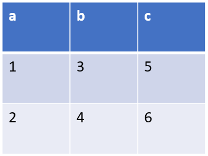
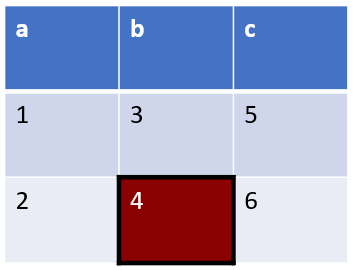
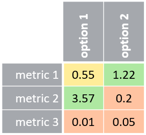

# Table styling

A few examples on how to style a table.

## Default table

A table/dataframe with regular values will use the default .pptx table style:

```julia
using PPTX, DataFrames

p = Presentation(title="Table", author="PPTX.jl")
s = Slide(title="table example")
push!(p, s)

df = DataFrame(a = [1,2], b = [3,4], c = [5,6])
t = Table(df; offset_x=50, offset_y=50, size_x=80, size_y=60)

push!(s, t)

write("example.pptx", p; overwrite=true)
```

```@raw html

```

## General table styles

You can disable the `header` (automatically generated from the dataframe column names) and the `bandrow` (the 'banded' or alternating coloring of different rows).

```julia
using PPTX, DataFrames

p = Presentation(title="Table", author="PPTX.jl")
s = Slide(title="table example")
push!(p, s)

df = DataFrame(a = [1,2], b = [3,4], c = [5,6])
t = Table(df;
    header=false, bandrow=false,
    offset_x=50, offset_y=50, size_x=80, size_y=40
)

push!(s, t)

write("example.pptx", p; overwrite=true)
```

```@raw html

```

## Table element styling

You can overrule the table style per element.

For example, let's color one box and add lines around it. We'll also center the alignment and anchor (vertical alignment) of the text.

And let's also change the `dash` value. Possible values are "solid", "dot", "dash", "dashDot", "lgDash", "lgDashDot", "sysDash", "sysDashDotDot". Default is "solid".

You may have to fiddle a little with the lines, since neighboring cells have priority.

```julia
using PPTX, DataFrames

p = Presentation(title="Table", author="PPTX.jl")
s = Slide(title="table example")
push!(p, s)

# missing color will make the cell transparant
t1 = TableCell(1; color=missing)

# a red cell with lines on all edges
# top and left are actually overruled by neighboring cells
t4 = TableCell(
    4;
    color=:darkred,
    textstyle=(color=:white,align=:center),
    anchor=:center,
    lines=(
        bottom=(width=3,color=:black),
        right=(width=3,color=:black,dash=:sysDash),
    )
)

# define lines of surrounding elements

t2 = TableCell(
    2;
    lines=(
        right=(width=3,color=:black,dash=:sysDash),
    )
)

t3 = TableCell(
    3;
    lines=(
        bottom=(width=3,color=:black),
    )
)

df = DataFrame(a = [t1,t2], b = [t3,t4], c = [5,6])
t = Table(df; offset = (50,50), size = (80,60))

push!(s, t)

write("example.pptx", p; overwrite=true)
```

```@raw html

```

## Table from Matrix

If you use a matrix as table content, the header will by default not be created. So you can add it manually through the styling.

Let's also add some more complexity, like text direction, margins, colors, lines, etc.

I will first define a few helper functions for the table cell styling:

```julia
using PPTX, Color

function row_header(x)
    return TableCell(
        x;
        color = RGB(165/255, 168/255, 173/255),
        textstyle = (align=:right, color=:white),
        margins = (bottom=0.2, left=0.2, right=0.2, top=0.2,),
        lines = (right=(width=3, color=:white),),
        anchor = :center,
    )
end

function column_header(x; color=RGB(165/255, 168/255, 173/255))
    return TableCell(
        x;
        color = color,
        textstyle = (align=:left, color=:white, bold=true),
        margins = (bottom=0.2, left=0.2, right=0.2, top=0.2,),
        lines = (bottom=(width=3, color=:white),),
        direction = :vert270,
        anchor = :center,
    )
end

function cell_value(x::Real)
    # cell color based on the value
    if x < 0.3
        # light red
        color = RGB(255/255, 195/255, 161/255)
    elseif x > 1.0
        # light green
        color = RGB(174/255, 232/255, 161/255)
    else # light orange
        color = RGB(255/255, 237/255, 153/255)
    end
    return TableCell(
        x;
        color = color,
        textstyle = (align=:center, color=:black),
        lines = (
            bottom = (width=1, color=:white),
            right = (width=1, color=:white),
            ),
        anchor = :center,
    )
end
```

Now let's create the table in PPTX, with custom row heights and column widths.

```julia
using PPTX, Colors

p = Presentation(title="Table", author="PPTX.jl")
s = Slide(title="matrix table example")
push!(p, s)

col1_values = ["metric 1", "metric 2", "metric 3"]
col1 = [column_header("", color=missing); row_header.(col1_values)]
col2_values = [0.55, 3.57, 0.01]
col2 = [column_header("option 1"); cell_value.(col2_values)]
col3_values = [1.22, 0.2, 0.05]
col3 = [column_header("option 2"); cell_value.(col3_values)]
cell_matrix = [col1 col2 col3]

t = Table(
    cell_matrix;
    offset = (50,50),
    column_widths = [30, 20, 20],
    row_heights = [30, 5, 5, 5],
)

push!(s, t)

write("example.pptx", p; overwrite=true)

```

```@raw html

```