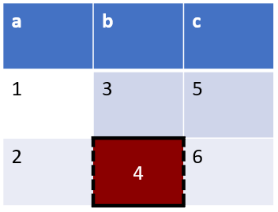

# Table styling

## Default table

A table/dataframe with regular values will use the default .pptx table style:

```julia
using PPTX, DataFrames

p = Presentation()
s = Slide(title="table example")
push!(p, s)

df = DataFrame(a = [1,2], b = [3,4], c = [5,6])
t = Table(df; offset_x=50, offset_y=50, size_x=80, size_y=60)

push!(s, t)

write("example.pptx", p; overwrite=true)
```

```@raw html

```

## General table styles

You can disable the `header` and the `bandrow`:

```julia
using PPTX, DataFrames

p = Presentation()
s = Slide(title="table example")
push!(p, s)

df = DataFrame(a = [1,2], b = [3,4], c = [5,6])
t = Table(df;
    header=false, bandrow=false,
    offset_x=50, offset_y=50, size_x=80, size_y=40
)

push!(s, t)

write("example.pptx", p; overwrite=true)
```

```@raw html

```

## Table element styling

You can overrule the table style per element. For example, let's color one box and add lines around it.

You may have to fiddle a little with the lines, since neighboring cells have priority.

```julia
using PPTX, Colors, DataFrames

p = Presentation()
s = Slide(title="table example")
push!(p, s)

# a red cell with lines on all edges
# top and left are actually overruled by neighboring cells
t4 = TableCell(
    4;
    color=colorant"darkred",
    textstyle=(color=colorant"white",),
    lines=(
        top=(width=3,color=colorant"black"),
        bottom=(width=3,color=colorant"black"),
        left=(width=3,color=colorant"black"),
        right=(width=3,color=colorant"black"),
    )
)

# define lines of surrounding elements

t2 = TableCell(
    2;
    lines=(
        right=(width=3,color=colorant"black"),
    )
)

t3 = TableCell(
    3;
    lines=(
        bottom=(width=3,color=colorant"black"),
    )
)

df = DataFrame(a = [1,t2], b = [t3,t4], c = [5,6])
t = Table(df; offset_x=50, offset_y=50, size_x=80, size_y=60)

push!(s, t)

write("example.pptx", p; overwrite=true)
```

```@raw html

```
